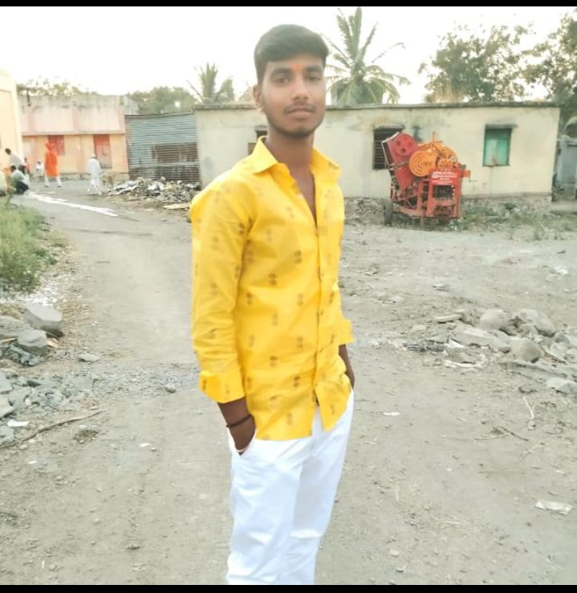

<!DOCTYPE html>
<html lang="en">
<head>
  <meta charset="UTF-8" />
  <meta name="viewport" content="width=device-width, initial-scale=1.0" />
  <title>Happy Birthday My Love ❤️</title>
  
</head>
<body>
  

  

    <h1>Happy Birthday My Love ❤️</h1>
    <h1>Dnyaneshwar</h1>

    

      <!-- Left 3 Photos -->
      

        
        
        
      

      <!-- Message Center Without Box -->
      

        माझ्या हृदयाच्या राजाला, वाढदिवसाच्या लाख लाख शुभेच्छा! <b>Saheb</b> 💕
        तुझं हासणं, तुझं बोलणं, तुझं माझ्यासोबत असणं... हे सगळं मला खूप आवडतं. ❤️
        <b>You’re My Special One Saheb</b>
        तुझ्याशिवाय माझं जीवन अपूर्ण वाटतं आणि तुझ्या प्रेमामुळेच ते पूर्ण झालंय.
        तू माझं स्वप्न आहेस, आणि माझ्या हृदयातली जी जागा तुझ्यासाठी आहे, ती आज, उद्या आणि कायम तुझीच राहील. ✨
        तुझं प्रत्येक स्वप्न पूर्ण होवो, आणि तुला सुख, समाधान, यश आणि अपार प्रेम लाभो. 🎉
        मला आयुष्यभर तुझ्यासोबत राहायचं आहे... माझं संपूर्ण आयुष्य फक्त तुझ्यासोबत घालवायचं आहे.
        मी फक्त तुझीच आहे, आणि तुझीच राहीन. ❤️
        <b>I Love You So Much ❤️</b>
      

      <!-- Right 3 Photos -->
      

        
        
        
      

    

    <!-- Bottom Cake and Balloons -->
    

      
      
    

  

</body>
</html>
